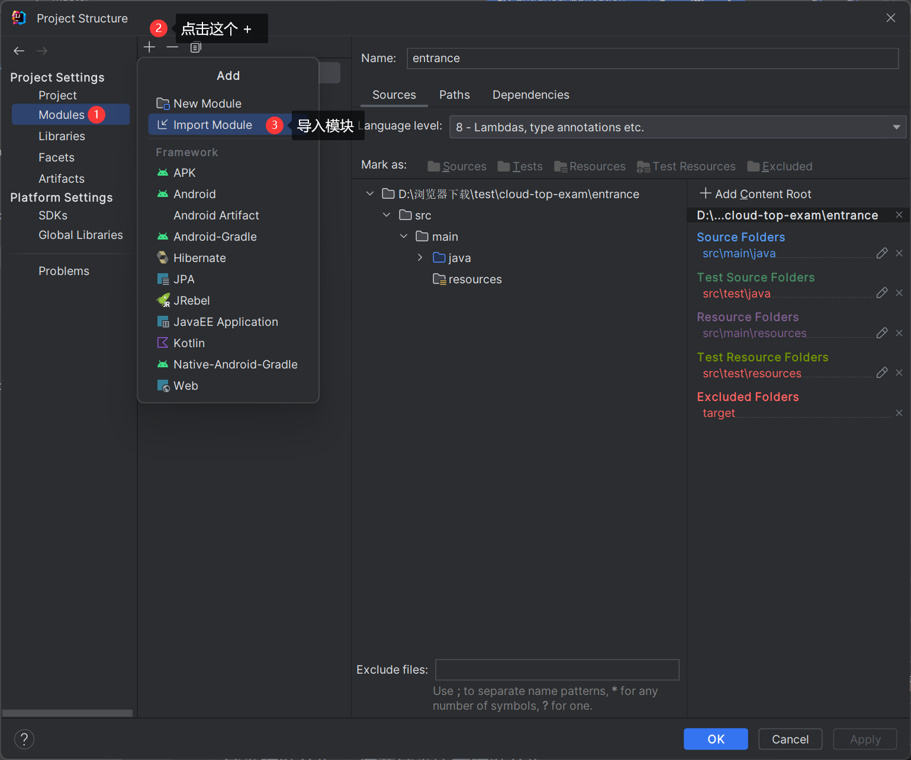

::: tip
在拉去项目之前，先确保你有以下基础环境
:::
## 前置基础环境
| 环境     | 版本           | 地址                                                                  |
|--------|--------------|---------------------------------------------------------------------|
| JDK    | 1.8          | https://www.oracle.com/java/technologies/downloads/?er=221886#java8 |
| NodeJs | 18.12.1      | https://nodejs.org/dist/v18.18.1/                                   |
| MySQL  | 8.0          | https://dev.mysql.com/downloads/installer/                          |
| Redis  | Windows（6.x） | https://gitee.com/redis-windows/redis-windows/releases        |
| Redis  | Linux版（6.x）  | https://mirrors.huaweicloud.com/redis/  |

::: tip
&emsp;&emsp;开发工具前端建议使用WebStorm，后端使用IDEA
:::

## 项目启动

### 后端项目的启动

项目拉取之后，还无法启动。这里需要手动配置一下`xxl-job-master`为项目模块👇：

::: tip
说明：这里我用的IDEA的新版UI，可能不同版本有差异。只需要找到 `setting -> Project Structure..` 就行。
:::

::: warning
到这里项目就构建成功了。但这里还需要配置一些数据库相关的东西。
:::

本项目使用了xxl-job，所以还需要在这里进行数据库配置

::: tip
到此，后端所有的配置都已经完成。
:::

启动`xxl-job`服务

启动整个项目的后端服务

**后端启动成功**

----

### 前端项目的启动

::: tip
启动前端项目之前，应该先启动后端，因为有些数据是从后端获取的。
:::

前端推荐使用`WebStorm`，这里为了方便演示，就在IDEA环境下操作了。

先打开idea的终端。

切换到前端学生端的文件夹下，执行`yarn`命令

同样的切换到前端管理端的文件夹下，执行`yarn`命令

最后点击启动按钮即可。
::: tip
1. 学生端的访问地址是：http://localhost:5173
2. 管理/教师端的访问地址是：http://localhost:5174
:::

::: danger
前端在打开页面的时候会非常的慢，很多朋友以为是项目有问题。这其实是正常的，这是由于Vite的原因。前端项目在启动之后，页面第一次访问都很慢，后边访问就快了。
:::

