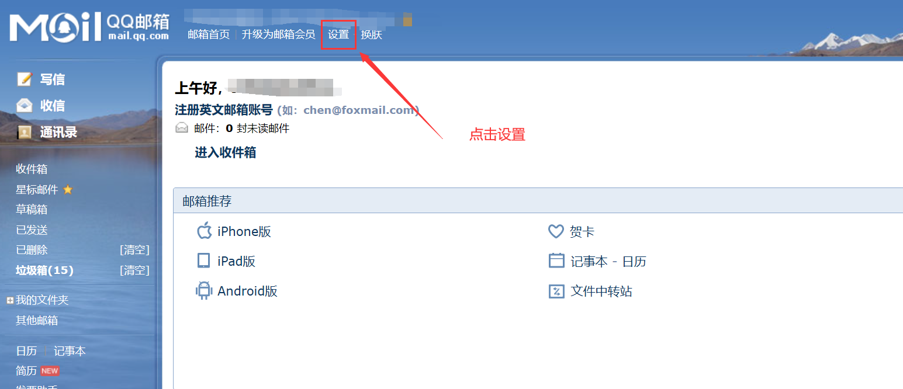
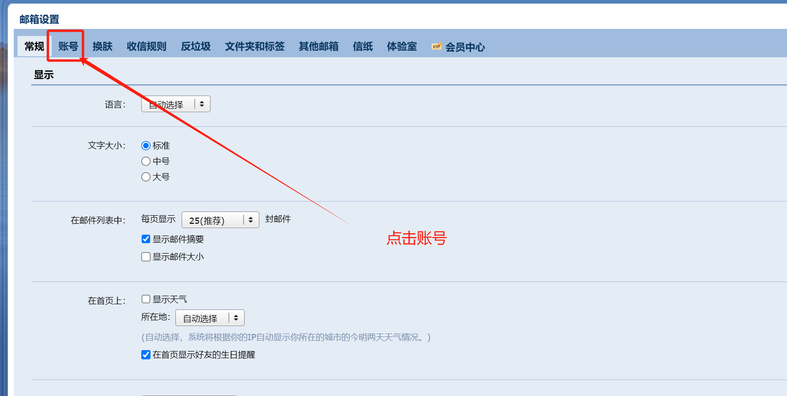
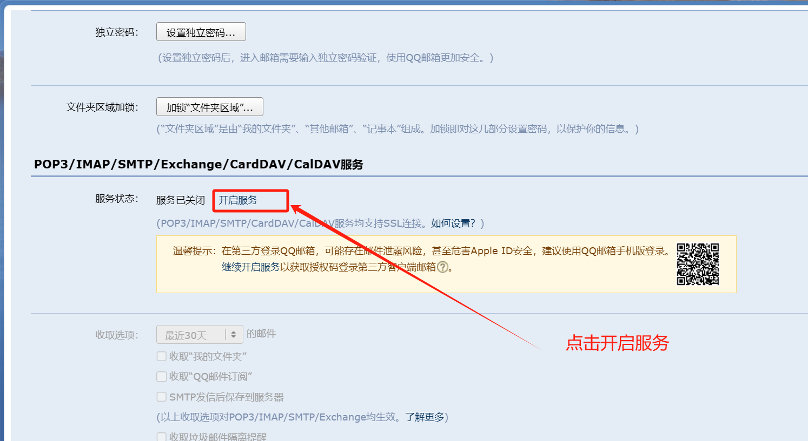
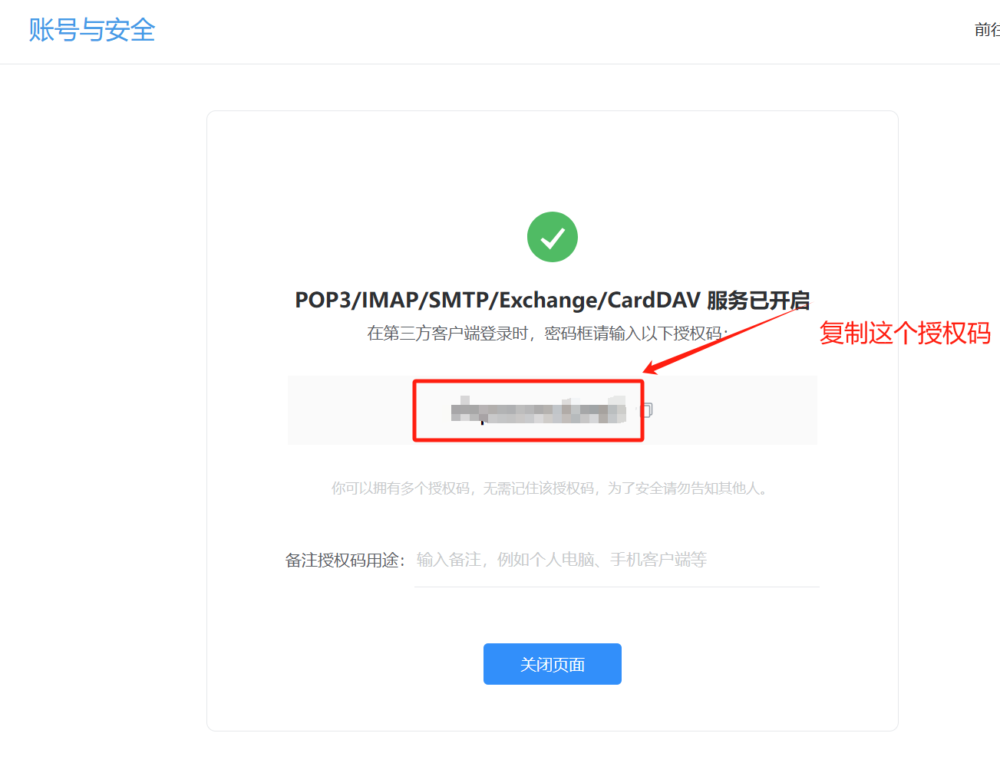
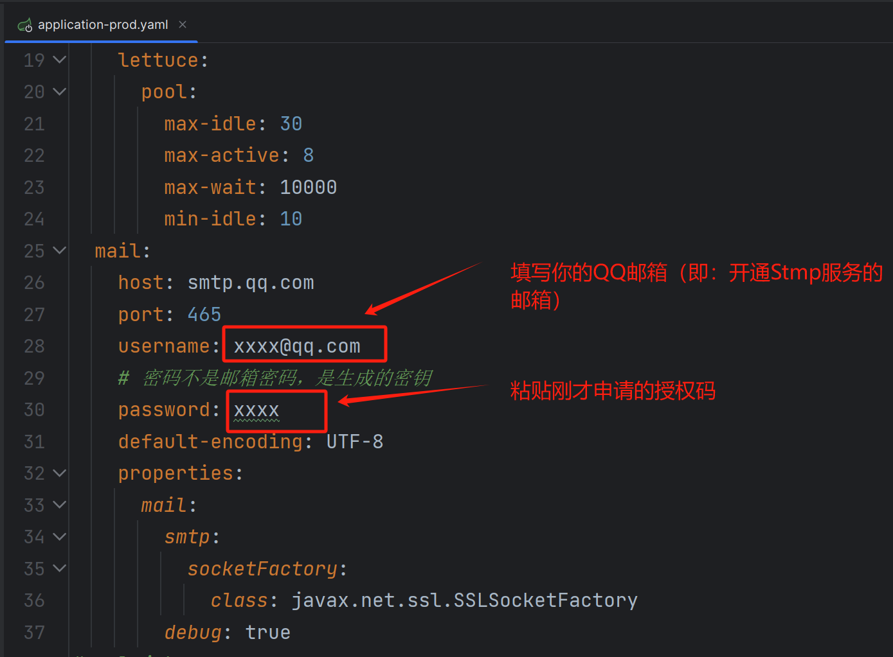

# 配置QQ邮箱邮件服务

::: tip
出现安装验证，点击 **前往验证** 即可。验证完之后，会出现 **授权码**。
:::

复制授权码在SpringBoot配置文件中配置即可。

::: tip
&emsp;&emsp;这一步本可以省略，但为了照顾不了解项目结构的朋友。说明一下：
entrance 是整个项目的入口模块。所有的配置文件都在：`entrance -> src -> main -> resources`下。
这个资源目录就是项目的配置文件。你只需要在`application-prod.yaml`添加、修改相应配置即可。
:::

