---
阿里云OSS配置
---

# 阿里云OSS配置

::: tip
这里只展示关于此项目中有关阿里云OSS的一些配置。<br/>
详细的配置可以参数官方的配置文档。[OSS快速入门_对象存储(OSS)-阿里云帮助中心](https://help.aliyun.com/zh/oss/getting-started/getting-started-with-oss)
:::
## 1. 创建Bucket

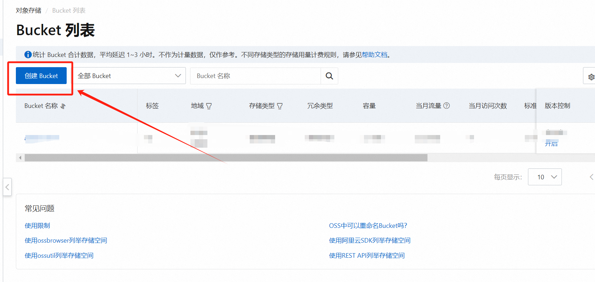

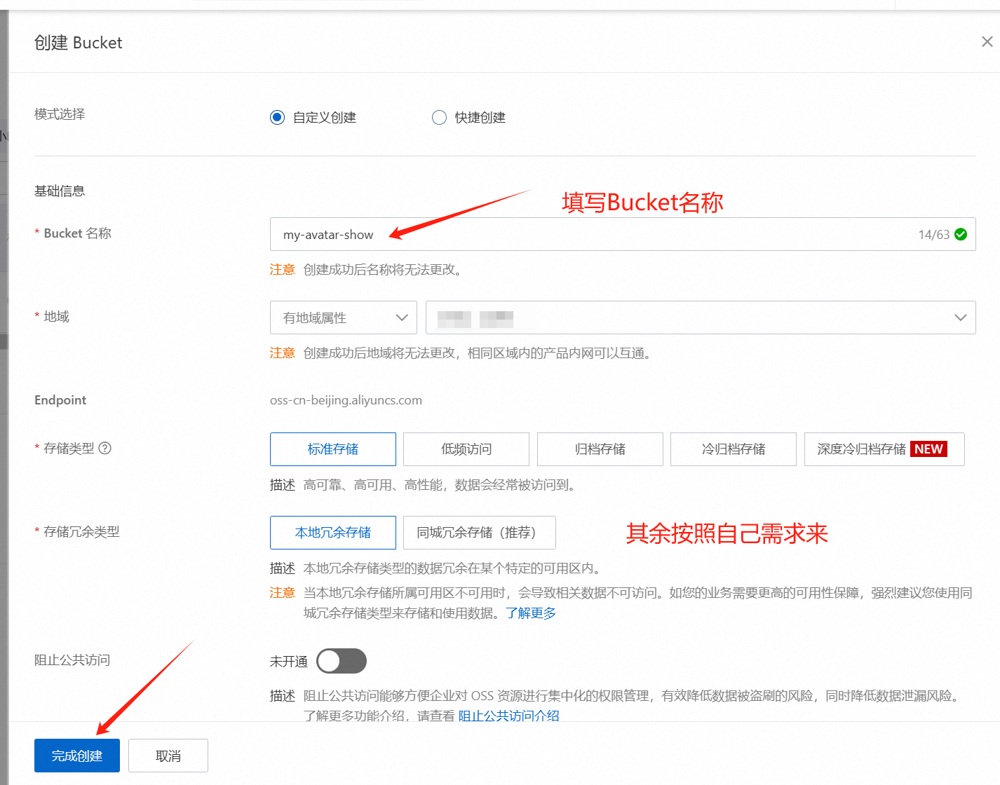

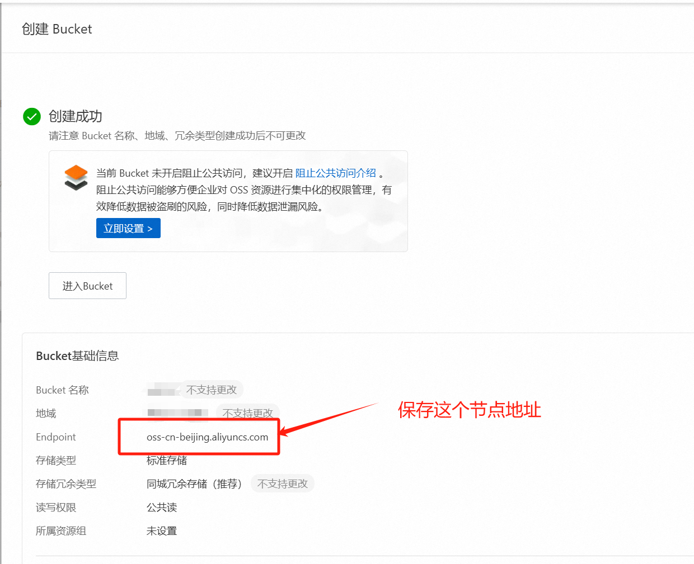

## 2. 创建子用户

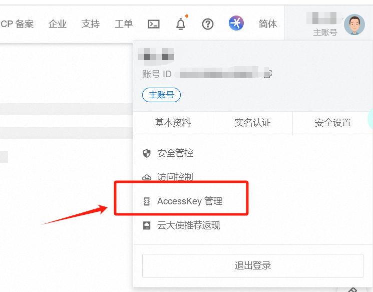

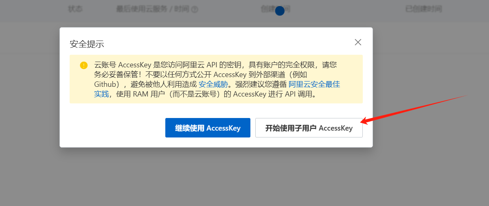

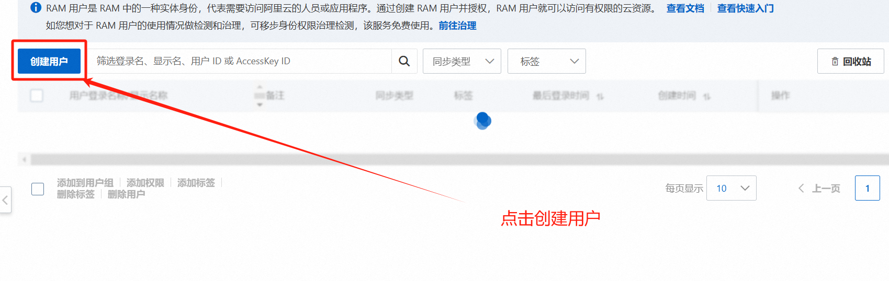

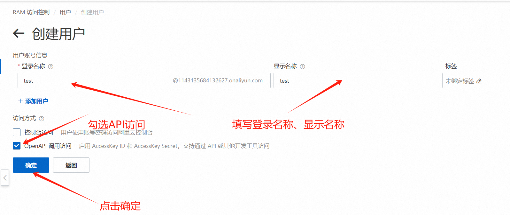

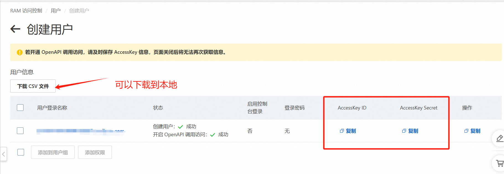

::: tip
确认之后，会得到`accessKeyId`和`accessKeySecret`。
**<font color=red>重要：记得保存</font>**
:::

## 3. 添加授权

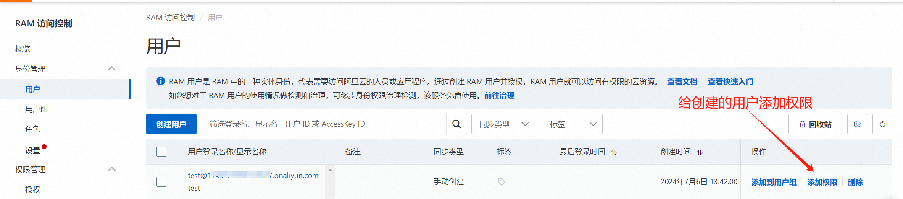


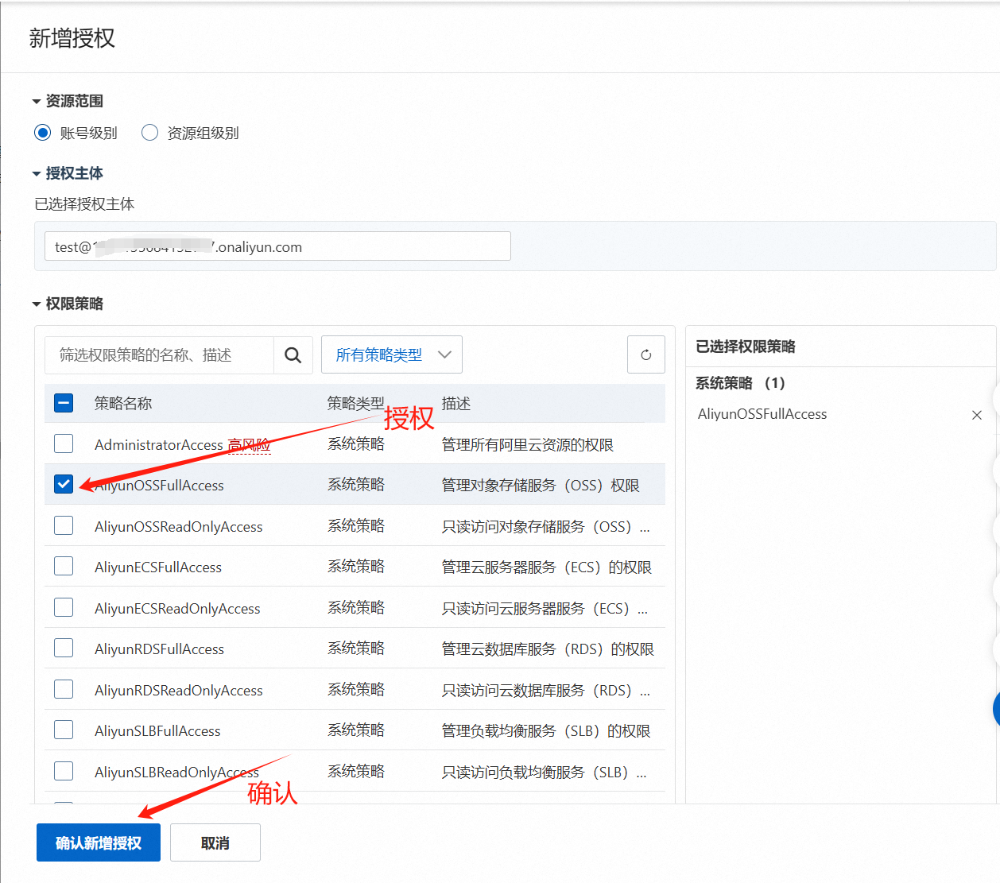

返回bucket列表，进入到自己刚才创建的Bucket中，新建目录
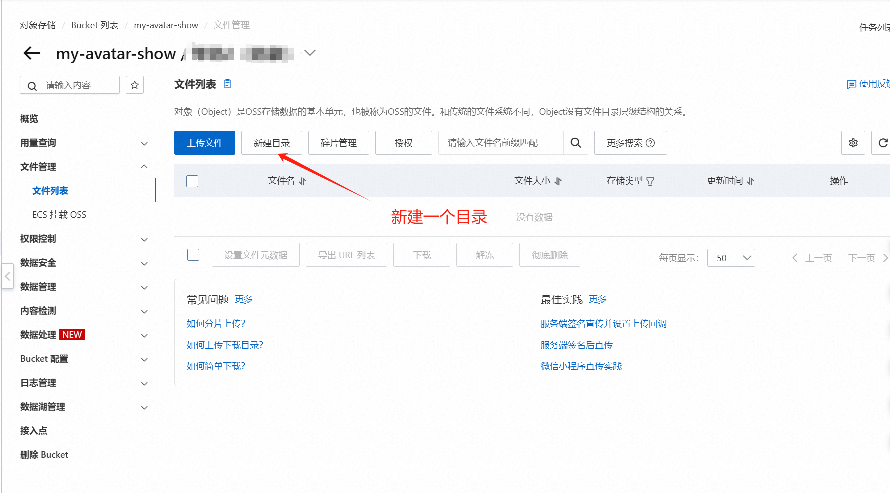

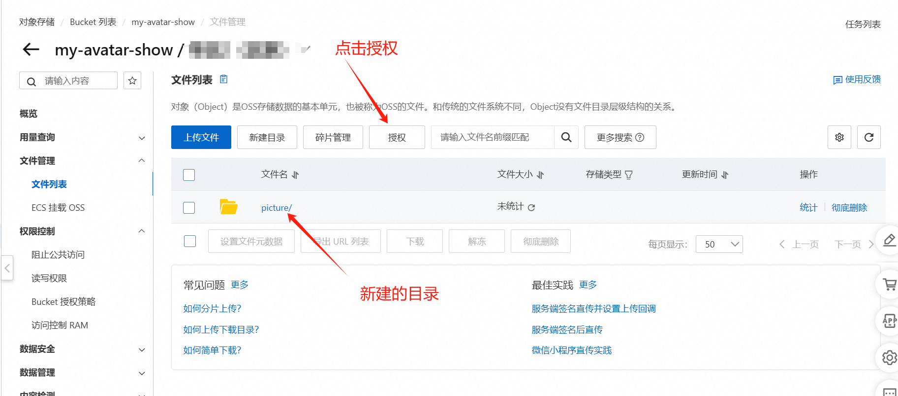

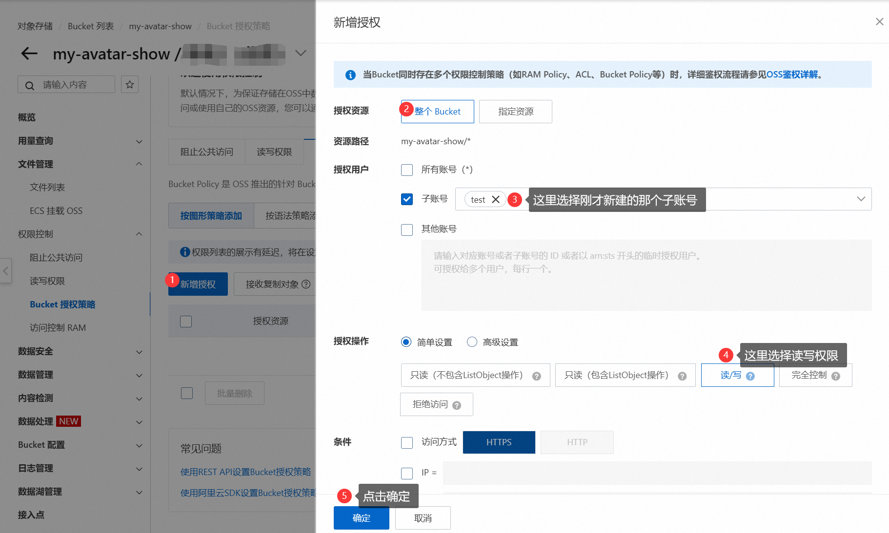

## 4. 配置SpringBoot

``` yaml {1,6-8}
aliyun:
  oss:
    endpoint: 第一步中获取到的节点域名
    accessKeyId: 第二步创建用户获取到的accessKeyId
    accessKeySecret:  第二步创建用户获取到的accessKeySecret
    bucketName: 第一步创建的Bucket名称
    maxSize: 1
    dir:
      prefix: Bucket中创建的目录名 （此示例中是：picture/）
```
