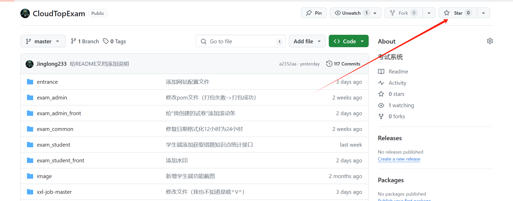
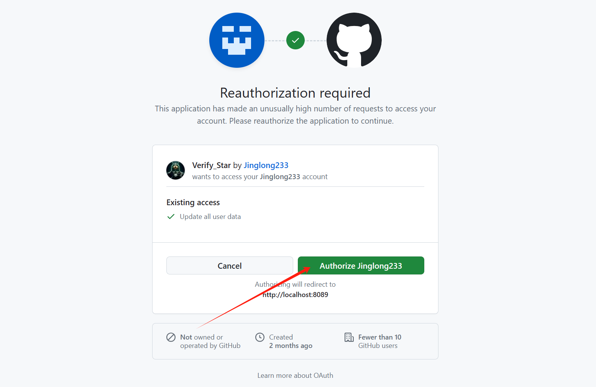
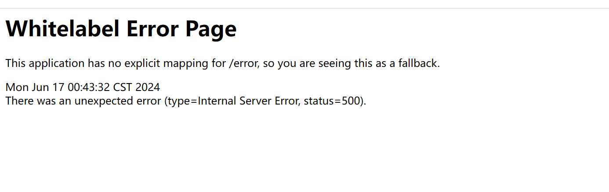

# 如何获取SQL文件

> 可通过以下两种方式来获取sql文件：

:::tip

- **前提：给仓库Star**

- 都必须star之后才可以获取SQL文件。

- 系统只有Mysql的数据
:::

1. 前往对应获取方式的仓库点star

- Gitee : [前往Gitee star](https://gitee.com/Jinglong233/cloud-top-exam)

- GitHub: [前往GitHub star](https://github.com/Jinglong233/CloudTopExam)

2. 点击对应按钮选择下载
- Gitee star点这个：
<GiteeVerfiy></GiteeVerfiy>
- Github star点这个：
<GitHubVerfiy></GitHubVerfiy>

# 可能遇到的问题
::: warning
GitHub跳转很慢（懂得都懂）....
:::

1. 需要授权

这种是需要授权，授权之后进行

2. 可能出现500的错误

这种情况就是访问速度太慢（Github），或者访问太频繁导致的。返回说明页面，重新试几次就行

